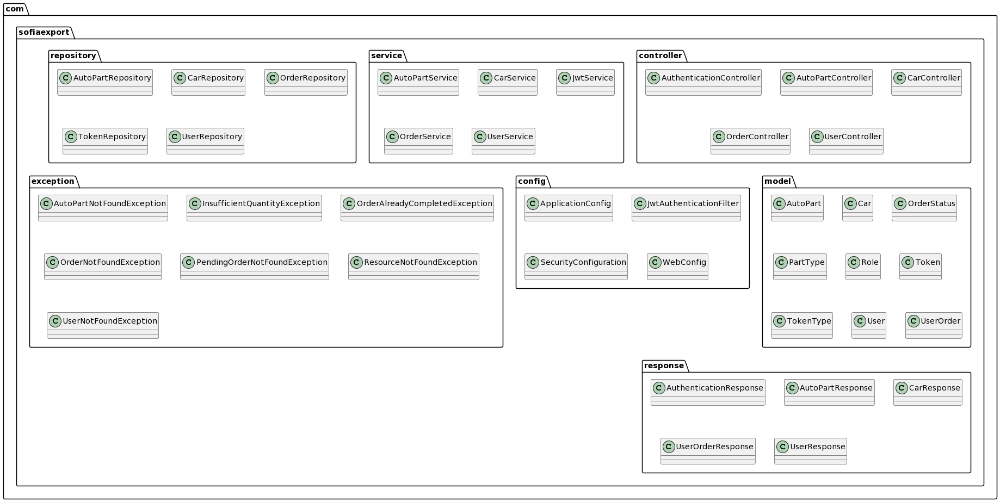
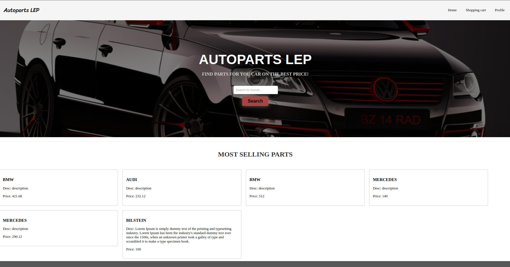
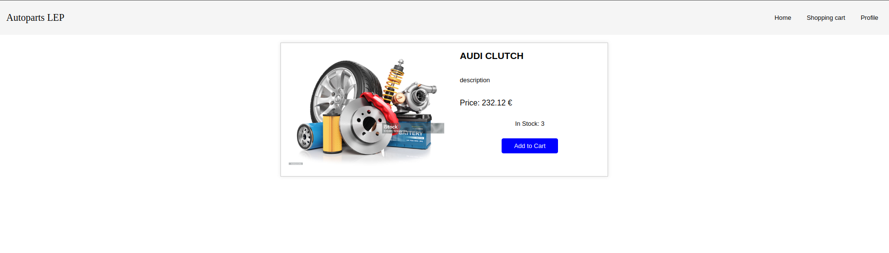
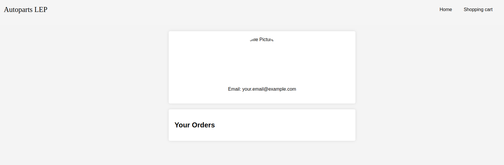

# Autoparts Shop EELP

## Introduction

Welcome to Autoparts Shop EELP, a comprehensive autoparts e-commerce platform developed using Spring, Gradle, and Swagger. This documentation serves as a guide to understanding the structure and design of our application.

## Purpose

The Autoparts Shop EELP project is organized into several key packages, each serving a specific purpose in the overall architecture. The following sections provide an overview of our package structure, detailing the main components, services, repositories, models, and other essential elements.

## Package Diagram

### com.sofiaexport

The `com.sofiaexport` package serves as the root namespace for our application. It encapsulates the primary components responsible for handling various aspects of the autoparts shop.

#### - controller

The `controller` package contains classes responsible for handling incoming HTTP requests and managing the flow of control within the application. Key controllers include `AuthenticationController`, `AutoPartController`, `CarController`, `OrderController`, and `UserController`.

#### - service

The `service` package houses service classes that implement business logic, including autopart services, car services, JWT services, order services, and user services.

#### - repository

In the `repository` package, we define repositories responsible for interacting with the database. Repositories include `AutoPartRepository`, `CarRepository`, `OrderRepository`, `TokenRepository`, and `UserRepository`.

#### - model

The `model` package comprises the core data models used throughout the application. Essential entities such as `AutoPart`, `Car`, `UserOrder`, and others are defined here.

#### - config

Configuration-related classes are grouped in the `config` package. Notable configurations include `ApplicationConfig`, `JwtAuthenticationFilter`, `SecurityConfiguration`, and `WebConfig`.

#### - exception

The `exception` package handles custom exceptions thrown by the application, such as `AutoPartNotFoundException`, `InsufficientQuantityException`, and others.

#### - response

The `response` package contains classes representing responses from the application, such as `AuthenticationResponse`, `AutoPartResponse`, `UserOrderResponse`, and more.

#### - ui

UI-related components, including styles and JavaScript files for different pages, are organized in the `ui` package. Subpackages like `cart`, `details`, `header`, `home`, `login`, `profile`, and `signup` contain resources for specific UI functionalities.

### UML Diagram



## Technologies Used

- **Spring**: The application leverages the Spring framework for building robust and scalable Java applications.

- **Gradle**: We use Gradle as our build automation tool, simplifying project configuration and dependency management.

- **Swagger**: Swagger is integrated into our project to facilitate API documentation and testing.


Certainly! Here's the System Deployment section in GitHub-flavored markdown:

System Deployment
--

### Installation:

- Clone the repository:
```
git clone https://github.com/your-username/autoparts-shop.git
```

- Navigate to the project directory:
```
cd autoparts-shop
```

- Build the project using Gradle wrapper:
```
./gradlew build
```

## Configuration

### Configure the application properties:
- Open `src/main/resources/application.properties` .
- Set database connection properties, third-party API keys, or any other configuration needed.

### Running the Application:

- Run the application using Gradle:
```
./gradlew bootRun
```
- The application will be accessible at `http://localhost:8080`

## Software and/or System Testing
### Test Strategy:
- **Unit Tests:**
  Ensure individual components work correctly.

- **Integration Tests:**
  Check interactions between different parts of the system.

- **End-to-End Tests:**
  Validate the entire application workflow.

### Testing Scenarios:
#### User Registration:
- Verify successful user registration.
- Ensure proper handling of duplicate email registration.

#### AutoPart Management:
- Test adding new auto parts.
- Validate the update and deletion of auto parts.

#### Order Processing:
- Check the addition and removal of items in the user's order.
- Test the order checkout process.

### Test Data:
Utilize mock data or create test cases with predefined data for various scenarios.

### Test Results and Analysis:
- Review test reports generated after running test suites.
- Analyze any test failures and address issues promptly.

## Application Walkthrough:
### Client-Side:
- **Home Page:**
  

- **Product Details:**
  

- **User Profile:**
  

### Server-Side:
- **Logging:**
  View logs for application events, errors, and warnings.

- **Database Interaction:**
  Access the database to verify data integrity.

- **API Endpoints:**
  Explore and test API endpoints using Swagger documentation.
